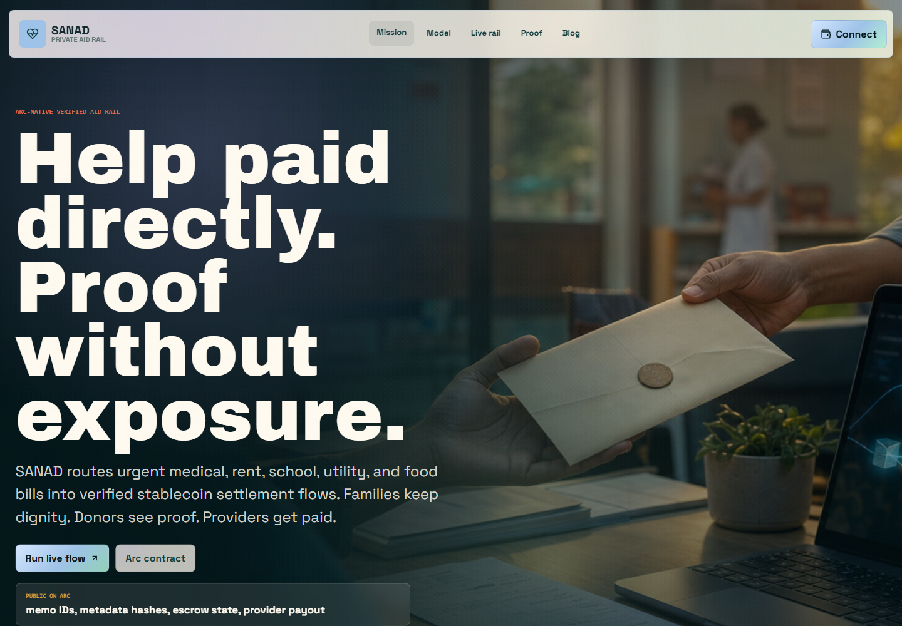
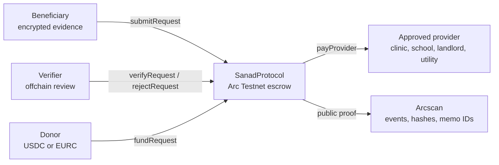

# SANAD Protocol

<p align="center">
  <strong>Private aid payments on Arc.</strong>
</p>

<p align="center">
  SANAD turns urgent medical, rent, school, and utility bills into verified stablecoin settlement flows:
  encrypted evidence in, provider payout out, dignity preserved.
</p>

<p align="center">
  <a href="https://sanad-arc.vercel.app"><strong>Live Demo</strong></a>
  |
  <a href="https://testnet.arcscan.app/address/0x222df65e3f6f5840d14b04f352eb647201064d6a"><strong>Arcscan Contract</strong></a>
  |
  <a href="docs/demo-proof.md"><strong>Testnet Proof</strong></a>
  |
  <a href="docs/architecture.md"><strong>Architecture</strong></a>
</p>

<p align="center">
  
</p>

<p align="center">
  
  
  
  
</p>

## What SANAD Is

SANAD is an Arc-native verified aid rail for private essential-bill settlement. It is not a public donation page and it is not an unrestricted cash-transfer app.

A beneficiary submits an encrypted bill bundle. A verifier checks the evidence offchain and writes a verification hash onchain. Donors fund the request in stablecoins. The smart contract releases funds only to the approved provider, such as a clinic, pharmacy, school, landlord, or utility.

The chain sees the request state, amount, token, provider, metadata hash, verifier hash, and memo ID. It does not store invoices, medical details, identity documents, diagnosis data, or private notes.

## Live Deployment

| Surface | Value |
| --- | --- |
| Production app | https://sanad-arc.vercel.app |
| Network | Arc Testnet |
| Chain ID | `5042002` |
| RPC | `https://rpc.testnet.arc.network` |
| Explorer | https://testnet.arcscan.app |
| Contract | `0x222df65e3f6f5840d14b04f352eb647201064d6a` |
| Deploy tx | `0x585602783a8a32cba8856e4b6f8ffd3e7365c36404684f8b6b2cf13a29b3f462` |
| Test token | Arc Testnet USDC interface at `0x3600000000000000000000000000000000000000` |

## Verified Testnet Run

The current deployment has a real Arc Testnet end-to-end proof.

| Step | Contract action | Public proof |
| --- | --- | --- |
| 1 | Allow provider | [`setProvider`](https://testnet.arcscan.app/tx/0x5292221167cb3c9a8a1adab7374196d1a1f927ceed90f0c1971ea964cc2f1126) |
| 2 | Allow verifier | [`setVerifier`](https://testnet.arcscan.app/tx/0xe7408d81c48269a9494a8f22bf3703a6ddf80ecad6bd6dd2c61709848745b254) |
| 3 | Submit aid request | [`submitRequest`](https://testnet.arcscan.app/tx/0x4be79509e05c854ea7cb734b15cbdac4752ada196c6f55ad6afb68c70b96baf7) |
| 4 | Verify request | [`verifyRequest`](https://testnet.arcscan.app/tx/0x161baa463188f487289aeec408343e6271f8d894effeb815e2318745ff2a8367) |
| 5 | Approve escrow transfer | [`approve`](https://testnet.arcscan.app/tx/0xf4f05308d513acfd87abff18e85012db0cb41360a97fb7e98273b18086ba2be2) |
| 6 | Fund request | [`fundRequest`](https://testnet.arcscan.app/tx/0x4512b05e25c1b866f9f90382f32eb94c8f3b5050ad8653fad390ffe3a529cb3b) |
| 7 | Pay provider | [`payProvider`](https://testnet.arcscan.app/tx/0xdb2bdc949d99f8d27da54bb3bb5c250c39cd0e6daa117638cd8e89bfab97602d) |

Final request state: `Paid`

Request tested: `1`

Memo shown in app: `SANAD-TST-0001`

Full proof notes: [`docs/demo-proof.md`](docs/demo-proof.md)

## Why Arc

SANAD is designed around payment operations, not speculation.

| Arc capability | Why SANAD needs it |
| --- | --- |
| USDC-native fees | Aid operations can be budgeted in the same unit donors fund with. |
| Fast deterministic settlement | Providers can reconcile payouts quickly after funding completes. |
| Transaction memos | Every request can carry a searchable operational reference. |
| App Kits path | Bridge, send, swap, and balance flows map naturally to aid desks. |
| Future privacy path | The MVP keeps evidence encrypted offchain today and can adopt stronger Arc privacy primitives later. |

## How The Protocol Works



## Request Lifecycle

| Status | Meaning |
| --- | --- |
| `Submitted` | A beneficiary created an aid object with provider, token, amount, memo ID, and metadata hash. |
| `Verified` | An approved verifier checked offchain evidence and stored a verification hash. |
| `Funded` | Donors fully funded the escrow amount. |
| `Paid` | The approved provider received the payout. |
| `Rejected` | A verifier rejected the request with a private reason hash. |
| `Cancelled` | The beneficiary cancelled before verification. |
| `Refunded` | Donors reclaimed funds from an expired request. |

## Contract Surface

`contracts/SanadProtocol.sol` includes:

- Provider allowlist.
- Verifier allowlist.
- Aid request creation.
- Verification and rejection.
- Partial donor funding.
- Direct provider payout.
- Expired-request refunds.
- Reentrancy guard around token movement.
- Safe ERC-20 transfer handling for tokens that return `false`, revert, or return no boolean.

Core read functions:

```solidity
requestCount()
getRequestCore(uint256 requestId)
getRequestProof(uint256 requestId)
contributions(uint256 requestId, address donor)
approvedProviders(address provider)
approvedVerifiers(address verifier)
```

Core write functions:

```solidity
setProvider(address provider, bool approved)
setVerifier(address verifier, bool approved)
submitRequest(address provider, address token, uint256 amount, bytes32 category, bytes32 metadataHash, bytes32 memoId, uint256 deadline)
verifyRequest(uint256 requestId, bytes32 verificationHash)
rejectRequest(uint256 requestId, bytes32 reasonHash)
fundRequest(uint256 requestId, uint256 amount)
payProvider(uint256 requestId)
refundExpired(uint256 requestId)
```

## Repository Map

| Path | Purpose |
| --- | --- |
| `contracts/SanadProtocol.sol` | Solidity contract for verified aid escrow and provider payout. |
| `src/` | React/Vite frontend connected to Arc Testnet through `viem`. |
| `src/sanadContract.ts` | Wallet, contract reads, writes, metadata hashes, and explorer helpers. |
| `scripts/deploy-arc.mjs` | Compiles with optimizer + `viaIR`, deploys to Arc, and writes the address to `.env`. |
| `scripts/test-arc-contract.mjs` | Runs the live Arc Testnet lifecycle proof. |
| `scripts/check-repo-safe.mjs` | Scans the repo for private-key style secrets before pushing. |
| `docs/` | Product, architecture, integration, deployment, security, and proof notes. |
| `vercel.json` | Production deployment settings for Vite on Vercel. |

## Quick Start

```bash
npm install
copy .env.example .env
npm run dev
```

Open the local Vite URL, connect Rabby or another injected wallet, and switch to Arc Testnet.

Useful commands:

```bash
npm run build
npm run check:repo-safe
npm run deploy:arc
npm run test:arc-contract
```

`npm run test:arc-contract` uses `ARC_DEPLOYER_PRIVATE_KEY` from `.env`. Keep `.env` private and never commit a real key.

## Vercel Deployment

The public production app is live at:

```text
https://sanad-arc.vercel.app
```

Vercel settings:

```text
Framework: Vite
Install: npm install
Build: npm run build
Output: dist
```

Public frontend environment variables:

```text
VITE_ARC_RPC_URL=https://rpc.testnet.arc.network
VITE_ARC_CHAIN_ID=5042002
VITE_SANAD_CONTRACT_ADDRESS=0x222df65e3f6f5840d14b04f352eb647201064d6a
```

The production bundle also contains the public Arc Testnet contract address as a fallback, so the demo still loads if Vite environment variables are not set.

Never set `ARC_DEPLOYER_PRIVATE_KEY` on Vercel.

## Security Boundary

This repository is ready for testnet demos, hackathons, grants, and technical review. It is not a mainnet audited financial product.

Already implemented:

- `.env` ignored and excluded from GitHub.
- `npm audit` passed with `0 vulnerabilities` at publication time.
- `check:repo-safe` scans for private-key style secrets.
- Contract stores hashes and memo IDs, not raw private evidence.
- Provider and verifier roles are allowlisted.
- Token movements use a reentrancy guard.

Required before real funds:

- Independent smart-contract audit.
- Unit and fuzz tests for every transition.
- Multisig or timelocked owner.
- Emergency pause and request limits.
- Multi-verifier approval for high-value or sensitive requests.
- Jurisdiction-specific review for aid, payments, privacy, and compliance.

## Roadmap

| Stage | Focus |
| --- | --- |
| MVP | Arc Testnet contract, live dashboard, verified request lifecycle. |
| Operator beta | Provider onboarding, verifier reputation, request search, audit exports. |
| Privacy beta | Encrypted evidence vault, salted canonical bundles, selective disclosure. |
| Scale | NGO batch operations, duplicate-invoice detection, grant reporting, provider analytics. |
| Production | Audit, multisig governance, incident response, compliance playbooks. |

## Project Thesis

Aid should not force people to publish their crisis.

SANAD makes essential-bill support verifiable for donors, operational for providers, and private for beneficiaries. The protocol keeps human context offchain, puts settlement guarantees onchain, and uses Arc as the payment layer for a new class of private, auditable aid rails.
