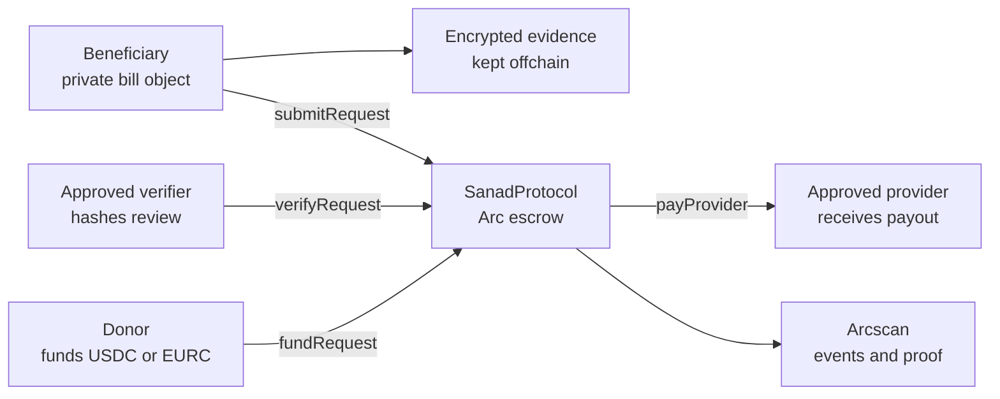

# SANAD Protocol

<p align="center">
  
</p>

<h3 align="center">Private aid payments on Arc.</h3>

<p align="center">
  SANAD turns urgent medical, rent, school, and utility bills into verified stablecoin settlement flows:
  encrypted evidence in, provider payout out, dignity preserved.
</p>

<p align="center">
  <a href="https://sanad-arc.vercel.app"><strong>Live app</strong></a>
  |
  <a href="https://sanad-arc.vercel.app/#blog"><strong>Project blog</strong></a>
  |
  <a href="https://testnet.arcscan.app/address/0xbf1ec5dc0ed9ca9356a2d5531894eaefdf111a03"><strong>Arcscan contract</strong></a>
  |
  <a href="docs/demo-proof.md"><strong>Testnet proof</strong></a>
  |
  <a href="https://x.com/ASPRO_22"><strong>ASPRO on X</strong></a>
</p>

<p align="center">
  
  
  
  
</p>

## The Idea

Aid should not force people to publish their crisis.

SANAD is an Arc-native verified aid rail for essential-bill settlement. A beneficiary can submit a private bill object, an approved verifier can review the evidence offchain, donors can fund the request with stablecoins, and the smart contract can release funds directly to the approved provider.

The public chain sees the settlement facts: provider, token, amount, request status, metadata hash, verifier hash, memo ID, and events. The chain does not store invoices, diagnosis details, ID documents, family identity, or private notes.

## Live Project

| Surface | Link |
| --- | --- |
| Production app | https://sanad-arc.vercel.app |
| Project blog | https://sanad-arc.vercel.app/#blog |
| GitHub repo | https://github.com/aspro45/sanad |
| Founder updates | https://x.com/ASPRO_22 |
| Arc docs | https://docs.arc.io |
| Arc faucet | https://faucet.circle.com |
| Arcscan | https://testnet.arcscan.app |

## Contract Deployment

| Item | Value |
| --- | --- |
| Network | Arc Testnet |
| Chain ID | `5042002` |
| RPC | `https://rpc.testnet.arc.network` |
| Contract | `0xbf1ec5dc0ed9ca9356a2d5531894eaefdf111a03` |
| Contract page | https://testnet.arcscan.app/address/0xbf1ec5dc0ed9ca9356a2d5531894eaefdf111a03 |
| Deploy tx | `0x7ab6533246b769ee2bc009e69519daf6fad45495daf16962c79ceb2dac4025a5` |
| Test USDC interface | `0x3600000000000000000000000000000000000000` |
| Test EURC interface | `0x89B50855Aa3bE2F677cD6303Cec089B5F319D72a` |

## Verified Arc Testnet Run

This deployment has a real end-to-end lifecycle proof on Arc Testnet. Request `1` was submitted, verified, funded, and paid to the approved provider.

| Step | Contract action | Public proof |
| --- | --- | --- |
| 1 | Allow provider | [`setProvider`](https://testnet.arcscan.app/tx/0x9a361d9caf5bc1d284e7bb2de6bd42dbcbf8f5d56955612cfa98a9ac8ea3b1d4) |
| 2 | Allow verifier | [`setVerifier`](https://testnet.arcscan.app/tx/0xa99ac0900346309f935ce451161153438dbaefcd3457add822758da75edb1b03) |
| 3 | Allow USDC test token | [`setToken`](https://testnet.arcscan.app/tx/0x0f130bb60b29959675c343146d64b47b8131087e7219da56362209b597f2a1a1) |
| 4 | Submit aid request | [`submitRequest`](https://testnet.arcscan.app/tx/0x57e8a3ed859a1ff9c0576b96978434056dd688211e9f1d677758593744246ac3) |
| 5 | Verify request | [`verifyRequest`](https://testnet.arcscan.app/tx/0x005720f4091e981194464da6fa93fea018cf4f8d2ba44d16f582de4429e88560) |
| 6 | Approve escrow transfer | [`approve`](https://testnet.arcscan.app/tx/0xb0e8386100112feb58a46f3d57f267dd57a634e64d5411780d4e52e977cdcd73) |
| 7 | Fund request | [`fundRequest`](https://testnet.arcscan.app/tx/0x8d716e825c5aa417bae19eed064967fb766278f86fb34cf932c9a8129e959aba) |
| 8 | Pay provider | [`payProvider`](https://testnet.arcscan.app/tx/0x1bd8d79ad38c464566bd70e13b7b246f028134228d7b1c342b38163590a74c73) |

Final state: `Paid`

Full notes: [`docs/demo-proof.md`](docs/demo-proof.md)

## Product Experience

The live website is built as a usable protocol surface, not only a landing page.

| Area | What it does |
| --- | --- |
| Private bill desk | Creates a request with category, provider, token, amount, deadline, and private note context. |
| Arc rail console | Reads live request data from the deployed Arc Testnet contract. |
| Proof packet | Shows metadata hash, verifier hash, memo ID, contract address, and Arcscan route. |
| Relief areas | Explains medical, housing, school, and utilities support with visual cards. |
| Protocol blog | Explains the problem, the Arc architecture, privacy boundary, and testnet proof. |
| Footer hub | Points users to GitHub, README, Arcscan, Arc docs, and ASPRO on X. |

## Protocol Flow



## Request States

| Status | Meaning |
| --- | --- |
| `Submitted` | A beneficiary created a request with provider, token, amount, memo ID, and metadata hash. |
| `Verified` | An approved verifier checked offchain evidence and posted a verification hash. |
| `Funded` | Donors fully funded the escrow amount. |
| `Paid` | The approved provider received the payout. |
| `Rejected` | A verifier rejected the request with a private reason hash. |
| `Cancelled` | The beneficiary cancelled before verification. |
| `Refunded` | Donors reclaimed funds from an expired request. |

## Smart Contract Surface

`contracts/SanadProtocol.sol` includes:

- Provider allowlist.
- Verifier allowlist.
- Token allowlist with per-token max request cap.
- Emergency pause for sensitive state transitions.
- Two-step ownership transfer.
- Aid request creation.
- Verification and rejection.
- Partial donor funding.
- Direct provider payout.
- Expired-request refunds.
- Request existence checks.
- Deadline range checks.
- Non-zero category, metadata, memo, verification, and rejection hashes.
- Reentrancy guard around token movement.
- Safe ERC-20 transfer handling for tokens that return `false`, revert, or return no boolean.

Core reads:

```solidity
requestCount()
getRequestCore(uint256 requestId)
getRequestProof(uint256 requestId)
contributions(uint256 requestId, address donor)
approvedProviders(address provider)
approvedVerifiers(address verifier)
```

Core writes:

```solidity
setProvider(address provider, bool approved)
setVerifier(address verifier, bool approved)
setToken(address token, bool approved, uint256 maxRequestAmount)
setPaused(bool shouldPause)
transferOwnership(address newOwner)
acceptOwnership()
submitRequest(address provider, address token, uint256 amount, bytes32 category, bytes32 metadataHash, bytes32 memoId, uint256 deadline)
verifyRequest(uint256 requestId, bytes32 verificationHash)
rejectRequest(uint256 requestId, bytes32 reasonHash)
fundRequest(uint256 requestId, uint256 amount)
payProvider(uint256 requestId)
refundExpired(uint256 requestId)
```

## Why Arc

SANAD is designed around payment operations, reconciliation, and public proof.

| Arc capability | Why SANAD uses it |
| --- | --- |
| Stablecoin-native settlement | Aid requests can be priced, funded, and reconciled in the same unit. |
| Fast finality | Providers can receive payouts quickly after funding completes. |
| Arcscan visibility | Donors and operators can verify public state without seeing private documents. |
| App Kits path | Wallet, send, balance, and operational flows map naturally to an aid desk. |
| Privacy roadmap | The MVP stores hashes today and can adopt stronger privacy primitives later. |

## Run Locally

```bash
npm install
copy .env.example .env
npm run dev
```

Open the Vite URL and connect Rabby or another injected wallet on Arc Testnet.

Public frontend values:

```text
VITE_ARC_RPC_URL=https://rpc.testnet.arc.network
VITE_ARC_CHAIN_ID=5042002
VITE_SANAD_CONTRACT_ADDRESS=0xbf1ec5dc0ed9ca9356a2d5531894eaefdf111a03
```

Private deployment/testing value:

```text
ARC_DEPLOYER_PRIVATE_KEY=0x...
```

Keep `.env` private. Never commit a real key.

## Quality Checks

```bash
npm run build
npm run check:repo-safe
npm audit
npm run test:contract:local
```

Live Arc Testnet proof:

```bash
npm run test:arc-contract
```

`npm run test:arc-contract` requires `ARC_DEPLOYER_PRIVATE_KEY` in `.env` and prints public transaction hashes only.

## Deploy Contract

```bash
npm run deploy:arc
```

The deploy script:

1. Compiles `contracts/SanadProtocol.sol` with optimizer and `viaIR`.
2. Deploys to Arc Testnet.
3. Writes the new contract address to `.env`.
4. Prints the Arcscan transaction link.

## Deploy Frontend

Production:

```text
https://sanad-arc.vercel.app
```

Vercel settings:

```text
Framework: Vite
Install: npm install
Build: npm run build
Output: dist
```

Set only public `VITE_` variables in Vercel. Do not set `ARC_DEPLOYER_PRIVATE_KEY` in Vercel.

## Repository Map

| Path | Purpose |
| --- | --- |
| `contracts/SanadProtocol.sol` | Solidity contract for verified aid escrow and provider payout. |
| `outputs/SanadProtocol_RemixReady.sol` | Single-file Remix copy of the contract. |
| `src/` | React/Vite frontend connected to Arc Testnet through `viem`. |
| `src/sanadContract.ts` | Contract reads, writes, wallet calls, hashes, and explorer helpers. |
| `scripts/deploy-arc.mjs` | Arc Testnet deployment script. |
| `scripts/test-arc-contract.mjs` | Live Arc Testnet lifecycle proof script. |
| `scripts/test-contract-local.mjs` | Local runtime contract tests with Ganache. |
| `scripts/check-repo-safe.mjs` | Private-key style secret scan before pushing. |
| `docs/` | Architecture, Arc integration, security model, deployment checklist, and proof notes. |
| `public/` | Production visual assets used by the website. |
| `vercel.json` | Vite deployment settings for Vercel. |

## Security Boundary

SANAD is ready for Arc Testnet demos, hackathons, grant review, and technical feedback. It is not a mainnet audited financial product.

Implemented now:

- `.env` is ignored and excluded from GitHub.
- `check:repo-safe` scans the repo for private-key style secrets.
- Contract stores hashes and memo IDs, not raw private evidence.
- Provider and verifier roles are allowlisted.
- Tokens are allowlisted with max request caps.
- Emergency pause is available for submit, verify, reject, fund, pay, and cancel flows.
- Ownership uses a two-step handoff to reduce wrong-address transfers.
- Missing request IDs revert instead of mutating empty storage.
- Deadlines are bounded between 1 hour and 90 days.
- Proof hashes must be non-zero.
- Token movement uses a reentrancy guard.
- Local contract tests cover owner checks, allowlists, token caps, pause, missing requests, submit, verify, fund, payout, cancel, reject, refund, and ownership transfer paths.

Required before real funds:

- Independent smart-contract audit.
- Expanded unit, fuzz, and invariant tests.
- Multisig or timelocked owner.
- Emergency pause and request limits.
- Multi-verifier approval for high-value or sensitive requests.
- Jurisdiction-specific review for aid, payments, privacy, and compliance.

## Roadmap

| Stage | Focus |
| --- | --- |
| MVP | Arc Testnet contract, live dashboard, verified request lifecycle, project blog. |
| Operator beta | Provider onboarding, verifier reputation, request search, CSV exports, grant dashboards. |
| Privacy beta | Encrypted evidence vault, canonical evidence bundles, selective disclosure. |
| Scale | NGO batch operations, duplicate-invoice detection, provider analytics, field workflows. |
| Production | Audit, multisig governance, incident response, compliance playbooks. |

## License

MIT
